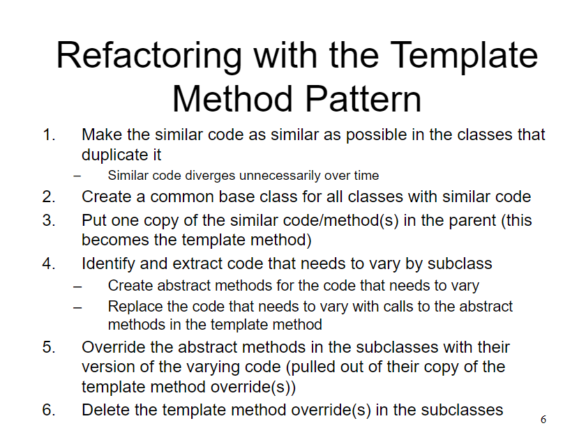

```/**
* An abstract class that is common to several
* games in which players play against the others,
* but only one is playing at a given time.
*/
export abstract class Game {
  public playOneGame(playersCount: number): void {
    this.initializeGame();

    let currentPlayerIndex = 0;
    while(!this.endOfGame()) {
      this.makePlay(currentPlayerIndex);
      currentPlayerIndex =
          (currentPlayerIndex + 1) % playersCount;
    }

    this.printWinner();
  }

  protected abstract initializeGame(): void;
  protected abstract makePlay(playerIndex: number):
void;
  protected abstract endOfGame(): boolean;
  protected abstract printWinner(): void;
}

/**
* An extension of the game class that implements
* the game of Monopoly
*/
export class Monopoly extends Game {

  /* Specific variable declarations for the
     Monopoly game. */

  protected initializeGame(): void {
    // Initialize players
    // Initialize money
  }

  protected makePlay(playerIndex: number): void {
    // Process one turn of a player
  }

  protected endOfGame(): boolean {
    // Replace with code that returns true if game is
    // over according to the rules of Monopoly
    return false;
  }

  protected printWinner(): void {
    // Display who won
  }

  /* Specific method for the Monopoly game */
}```

